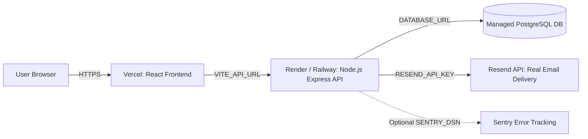

# TaskFlow Production Deployment Runbook

This guide details how to deploy **TaskFlow** to production using **Render / Railway** for the Node.js API + PostgreSQL database, **Resend** for transactional emails, and **Vercel** for the React frontend.

---

## 🏗️ Architecture Overview



---

## 🚀 Step 1: Deploy Backend & Database (Render / Railway)

### Option A: Render (Easiest Blueprint)
1. Push your repository to GitHub or GitLab.
2. Go to [dashboard.render.com](https://dashboard.render.com) and click **New > Blueprint**.
3. Connect your repository. Render will automatically read [`render.yaml`](file:///home/brexc/projects/taskflow/render.yaml) and provision:
   - **PostgreSQL Database** (`taskflow-db`)
   - **Node.js Web Service** (`taskflow-backend`)
4. In the Render Web Service settings, verify the environment variables:
   - `DATABASE_URL`: Automatically linked to your PostgreSQL database.
   - `JWT_SECRET`: Auto-generated 64-character secret.
   - `NODE_ENV`: `production`
   - `RESEND_API_KEY`: Your Resend API key (e.g. `re_123456...`).
   - `EMAIL_FROM`: `TaskFlow <onboarding@resend.dev>` or `TaskFlow <notifications@yourdomain.com>`.
   - `CORS_ORIGIN`: Your Vercel frontend URL (e.g. `https://taskflow.vercel.app`).
   - `APP_URL`: Your Vercel frontend URL (e.g. `https://taskflow.vercel.app`).

### Option B: Railway
1. Create a new project at [railway.app](https://railway.app).
2. Add a **PostgreSQL** plugin.
3. Add a service from your GitHub repo (`Root Directory: backend`).
4. Set the build command: `npm install && npx prisma generate && npx prisma migrate deploy`
5. Set start command: `npm start`
6. Add the environment variables (`DATABASE_URL`, `JWT_SECRET`, `CORS_ORIGIN`, `APP_URL`, `RESEND_API_KEY`).

---

## 📧 Step 2: Configure Real Email Delivery (Two Options)

### Option A: Resend (Recommended with Custom Domain)

1. Create a free account at [resend.com](https://resend.com).
2. Create an API Key in **API Keys** and add it to your backend environment variables:
   ```env
   RESEND_API_KEY=re_your_api_key_here
   ```
3. **To deliver to ANY external email address (Gmail, Yahoo, Outlook, etc.)**:
   > [!IMPORTANT]
   > Resend's free sandbox sender (`onboarding@resend.dev`) is restricted by Resend's security policy to deliver **only to the email address used to register your Resend account**. To deliver verification links to registering users (e.g. `gnariandonneg@gmail.com`), you must verify a domain:
   - Go to **Domains** in your [Resend Dashboard](https://resend.com/domains).
   - Click **Add Domain** (e.g. `yourdomain.com` or `taskflow.app`).
   - Add the 3 DNS records (DKIM, SPF, MX/DMARC) in your domain registrar (Cloudflare, Namecheap, GoDaddy, etc.).
   - Once verified, update `EMAIL_FROM` in your Render / Railway environment:
     ```env
     EMAIL_FROM="TaskFlow <notifications@yourdomain.com>"
     ```

---

### Option B: Gmail SMTP (100% Free — No Custom Domain Needed!)

If you don't own a custom domain, you can deliver real emails directly to any Gmail or external user using a **Google App Password**:

1. Log into your Google / Gmail account and go to **Security** -> **2-Step Verification**.
2. Scroll to the bottom and click **App passwords** (or search "App passwords").
3. Create an App password named `TaskFlow` and copy the generated 16-character code (e.g. `abcd efgh ijkl mnop`).
4. Set the following environment variables in your backend on Render / Railway:
   ```env
   SMTP_HOST=smtp.gmail.com
   SMTP_PORT=465
   SMTP_USER=your-admin-email@gmail.com
   SMTP_PASS=abcdefghijklmnop
   EMAIL_FROM="TaskFlow <your-admin-email@gmail.com>"
   ```
5. *(Optional)* Remove `RESEND_API_KEY` so the backend automatically uses your Gmail SMTP.

---

## ⚡ Step 3: Deploy Frontend to Vercel

1. Log in to [vercel.com](https://vercel.com) and click **Add New > Project**.
2. Import your GitHub repository.
3. In the project setup:
   - **Root Directory**: Click edit and select `frontend`.
   - **Framework Preset**: `Vite` (auto-detected).
   - **Build Command**: `npm run build`
   - **Output Directory**: `dist`
4. Add the Environment Variable:
   - `VITE_API_URL`: Your live backend API URL (e.g. `https://taskflow-backend.onrender.com`).
   > [!WARNING]
   > In Vite, `VITE_API_URL` is baked into the JavaScript bundle at **build time**. If you add or change `VITE_API_URL` in Vercel, you **must trigger a new Redeploy** (Deployments > ... > Redeploy) for the changes to take effect!
5. Click **Deploy**.

---

## 🔁 Step 4: Final Connection & Cross-Origin Sync

Once your Vercel frontend is live (e.g. `https://taskflow-proj.vercel.app`):
1. Copy the Vercel URL.
2. Update the backend environment variables on Render / Railway:
   - `CORS_ORIGIN` = `https://taskflow-proj.vercel.app`
   - `APP_URL` = `https://taskflow-proj.vercel.app`
3. Restart / redeploy the backend service.

---

## 🛠️ Troubleshooting Common Issues

### 1. Stuck on "Creating account..." or button disabled
- **Vercel `VITE_API_URL` missing or not redeployed**: If `VITE_API_URL` is not set in Vercel, API requests default to `http://localhost:3000`, which hangs or gets blocked by browser security. Go to Vercel > Settings > Environment Variables, add `VITE_API_URL = https://your-backend.onrender.com`, and click **Deployments > ... > Redeploy**.
- **Render Free Tier Cold Start**: Render spins down free web services after 15 minutes of inactivity. The first request after idle can take ~50–90 seconds while the container boots. Once awake, subsequent requests respond in under 50ms.
- **Backend crash on startup**: Check your Render backend logs. Ensure all required environment variables (`DATABASE_URL`, `JWT_SECRET`, `CORS_ORIGIN`, `APP_URL`, plus either `RESEND_API_KEY` or `SMTP_*`) are present.

### 2. Email verification link not arriving in Gmail
- **Using Resend without custom domain**: `onboarding@resend.dev` only delivers to the owner's Resend email. Verify a custom domain in Resend, or switch to **Option B (Gmail SMTP)** above to deliver to any user immediately.
- **Check Spam Folder**: Transactional emails sent from new domains or test addresses may initially land in Gmail's "Spam" or "Promotions" tab.
- **Resend from Dashboard**: Users can click "Resend verification email" from the dashboard banner anytime.

---

## ✅ Deployment Checklist

- [ ] Backend health check responds `{"status":"ok","db":"connected"}` at `https://<backend-url>/health`.
- [ ] Vercel `VITE_API_URL` points to live backend URL (e.g. `https://taskflow-backend.onrender.com`) and frontend redeployed.
- [ ] Render `CORS_ORIGIN` and `APP_URL` point to live Vercel URL (e.g. `https://taskflow-proj.vercel.app`).
- [ ] Email delivery configured via **Resend (with custom domain)** or **Gmail SMTP (with App Password)**.
- [ ] User registration sends real verification email to Gmail.
- [ ] Verification link in email directs user to `https://<frontend-url>/verify-email?token=...` and marks account verified.
- [ ] Forgot password link sends real reset token email.
