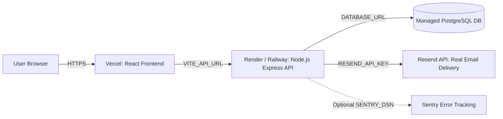

# TaskFlow Production Deployment Runbook

This guide details how to deploy **TaskFlow** to production using **Render / Railway** for the Node.js API + PostgreSQL database, **Resend** for transactional emails, and **Vercel** for the React frontend.

---

## 🏗️ Architecture Overview



---

## 🚀 Step 1: Deploy Backend & Database (Render / Railway)

### Option A: Render (Easiest Blueprint)
1. Push your repository to GitHub or GitLab.
2. Go to [dashboard.render.com](https://dashboard.render.com) and click **New > Blueprint**.
3. Connect your repository. Render will automatically read [`render.yaml`](file:///home/brexc/projects/taskflow/render.yaml) and provision:
   - **PostgreSQL Database** (`taskflow-db`)
   - **Node.js Web Service** (`taskflow-backend`)
4. In the Render Web Service settings, verify the environment variables:
   - `DATABASE_URL`: Automatically linked to your PostgreSQL database.
   - `JWT_SECRET`: Auto-generated 64-character secret.
   - `NODE_ENV`: `production`
   - `RESEND_API_KEY`: Your Resend API key (e.g. `re_123456...`).
   - `EMAIL_FROM`: `TaskFlow <onboarding@resend.dev>` or `TaskFlow <notifications@yourdomain.com>`.
   - `CORS_ORIGIN`: Your Vercel frontend URL (e.g. `https://taskflow.vercel.app`).
   - `APP_URL`: Your Vercel frontend URL (e.g. `https://taskflow.vercel.app`).

### Option B: Railway
1. Create a new project at [railway.app](https://railway.app).
2. Add a **PostgreSQL** plugin.
3. Add a service from your GitHub repo (`Root Directory: backend`).
4. Set the build command: `npm install && npx prisma generate && npx prisma migrate deploy`
5. Set start command: `npm start`
6. Add the environment variables (`DATABASE_URL`, `JWT_SECRET`, `CORS_ORIGIN`, `APP_URL`, `RESEND_API_KEY`).

---

## 📧 Step 2: Configure Resend for Real Email Delivery

1. Create a free account at [resend.com](https://resend.com).
2. Create an API Key in **API Keys** and copy the `re_...` string into your backend environment variable:
   ```env
   RESEND_API_KEY=re_your_api_key_here
   ```
3. **To deliver to ANY external email address**:
   - Go to **Domains** in the Resend dashboard.
   - Click **Add Domain** (e.g. `yourcompany.com` or `taskflow.app`).
   - Add the 3 DNS records (DKIM, SPF, MX) provided by Resend to your domain registrar (Cloudflare, Namecheap, GoDaddy, etc.).
   - Once verified, update `EMAIL_FROM`:
     ```env
     EMAIL_FROM="TaskFlow <notifications@yourcompany.com>"
     ```
   *(Note: Without a custom domain, Resend sandbox delivers only to your own registered account email).*

---

## ⚡ Step 3: Deploy Frontend to Vercel

1. Log in to [vercel.com](https://vercel.com) and click **Add New > Project**.
2. Import your GitHub repository.
3. In the project setup:
   - **Root Directory**: Click edit and select `frontend`.
   - **Framework Preset**: `Vite` (auto-detected).
   - **Build Command**: `npm run build`
   - **Output Directory**: `dist`
4. Add the Environment Variable:
   - `VITE_API_URL`: Your live backend API URL (e.g. `https://taskflow-backend.onrender.com`).
   - *(Optional)* `VITE_SENTRY_DSN`: Your Sentry frontend DSN if using Sentry.
5. Click **Deploy**.
   - React Router single-page navigation is automatically handled via [`frontend/vercel.json`](file:///home/brexc/projects/taskflow/frontend/vercel.json).

---

## 🔁 Step 4: Final Connection & Cross-Origin Sync

Once your Vercel frontend is live (e.g. `https://taskflow-app.vercel.app`):
1. Copy the Vercel URL.
2. Update the backend environment variables on Render / Railway:
   - `CORS_ORIGIN` = `https://taskflow-app.vercel.app`
   - `APP_URL` = `https://taskflow-app.vercel.app`
3. Restart / redeploy the backend service.

---

## ✅ Deployment Checklist

- [ ] Backend health check responds `{"status":"ok","db":"connected"}` at `https://<backend-url>/health`.
- [ ] User registration sends real verification email via Resend.
- [ ] Verification link in email directs user to `https://<frontend-url>/verify-email?token=...` and verifies account.
- [ ] Forgot password link sends real reset token email.
- [ ] Multi-team tasks, comments, activity log, and dark mode persist seamlessly.
