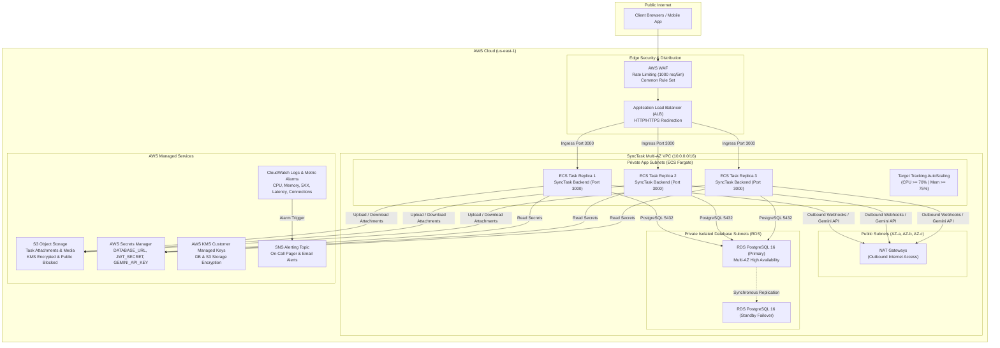

# SyncTask — Cloud Infrastructure as Code (Terraform)

This directory contains the production-grade, modular [Terraform](https://www.terraform.io/) configurations for provisioning and managing **SyncTask** cloud infrastructure on Amazon Web Services (AWS).

---

## 1. Architecture Topology



---

## 2. Directory Structure

```text
infra/
├── README.md                                 # Full Architecture & Runbook Guide
├── environments/
│   ├── staging/
│   │   ├── main.tf                          # Staging environment composition
│   │   ├── variables.tf                     # Staging variable definitions
│   │   ├── outputs.tf                       # Staging outputs (ALB DNS, DB endpoint, etc.)
│   │   └── terraform.tfvars.example         # Staging configuration template
│   └── production/
│       ├── main.tf                          # Production environment composition (Multi-AZ)
│       ├── variables.tf                     # Production variable definitions
│       ├── outputs.tf                       # Production outputs
│       └── terraform.tfvars.example         # Production configuration template
└── modules/
    ├── networking/                          # VPC, Multi-AZ Subnets, NAT Gateways, Security Groups
    │   ├── main.tf
    │   ├── variables.tf
    │   └── outputs.tf
    ├── database/                            # RDS PostgreSQL (Multi-AZ, KMS Encryption, Backups)
    │   ├── main.tf
    │   ├── variables.tf
    │   └── outputs.tf
    ├── compute/                             # ECS Fargate Cluster, Task Def, Service, ALB, Autoscaling
    │   ├── main.tf
    │   ├── variables.tf
    │   └── outputs.tf
    ├── storage/                             # S3 Buckets, KMS Encryption, Public Access Block, CORS
    │   ├── main.tf
    │   ├── variables.tf
    │   └── outputs.tf
    └── monitoring/                          # CloudWatch Log Groups, Metric Alarms, SNS Alerts
        ├── main.tf
        ├── variables.tf
        └── outputs.tf
```

---

## 3. Security & Zero-Trust Principles

1. **Zero Hardcoded Secrets**:
   - Secrets (`DATABASE_URL`, `JWT_SECRET`, `GEMINI_API_KEY`, `RESEND_API_KEY`) are stored in **AWS Secrets Manager** and injected into ECS task definitions at runtime via IAM execution role permissions.
   - `.tfvars` files containing passwords or sensitive values are git-ignored.
2. **Strict Network Isolation**:
   - **Public Subnets**: Only ALBs and NAT Gateways reside here.
   - **Private App Subnets**: ECS Fargate tasks have no public IPs; outbound traffic routes strictly through NAT Gateways.
   - **Private DB Subnets**: Isolated subnets with **zero route to the internet**.
3. **Least-Privilege Security Groups**:
   - `alb_sg`: Accepts ingress on port 80/443 from `0.0.0.0/0`.
   - `ecs_sg`: Accepts ingress on port 3000 **strictly from `alb_sg`**.
   - `db_sg`: Accepts ingress on port 5432 **strictly from `ecs_sg`**.
4. **Encryption Everywhere**:
   - RDS PostgreSQL storage encrypted at rest with AWS KMS.
   - S3 attachments encrypted with AWS KMS (`aws:kms`).
   - In-transit encryption enforced via TLS 1.3 on ALB and `rds.force_ssl = 1` parameter group.
5. **AWS WAF Protection**:
   - Rate limiting (1000 requests per 5 minutes per IP).
   - AWS Managed Common Rule Set protecting against SQL injection, XSS, and exploit probes.

---

## 4. Prerequisites

1. **Terraform CLI** ($\ge 1.5.0$):
   ```bash
   terraform -v
   ```
2. **AWS CLI** ($\ge 2.0$) configured with appropriate IAM credentials:
   ```bash
   aws configure
   ```
3. **S3 Backend & DynamoDB State Lock Table** (One-time setup per AWS account):
   ```bash
   aws s3 mb s3://synctask-terraform-state-prod --region us-east-1
   aws dynamodb create-table \
       --table-name synctask-terraform-locks-prod \
       --attribute-definitions AttributeName=LockID,AttributeType=S \
       --key-schema AttributeName=LockID,KeyType=HASH \
       --billing-mode PAY_PER_REQUEST \
       --region us-east-1
   ```

---

## 5. Deployment Runbook

### Deploying to Staging

```bash
cd infra/environments/staging

# 1. Initialize providers and backend
terraform init

# 2. Copy and configure variables
cp terraform.tfvars.example terraform.tfvars
# (Edit terraform.tfvars with staging values)

# 3. Preview execution plan
terraform plan -out=staging.tfplan

# 4. Apply changes
terraform apply staging.tfplan
```

### Deploying to Production

```bash
cd infra/environments/production

# 1. Initialize providers and backend
terraform init

# 2. Copy and configure variables
cp terraform.tfvars.example terraform.tfvars
# (Edit terraform.tfvars with production values)

# 3. Preview execution plan
terraform plan -out=prod.tfplan

# 4. Apply changes
terraform apply prod.tfplan
```

---

## 6. Observability & Alarms

The monitoring module creates automated CloudWatch alarms linked to the SNS alert topic:

| Alarm Metric | Threshold | Action |
|---|---|---|
| **ECS CPU Utilization** | $\ge 80\%$ for 3 min | SNS Alert |
| **ECS Memory Utilization** | $\ge 85\%$ for 3 min | SNS Alert |
| **ALB 5XX Errors** | $\ge 5$ errors in 5 min | SNS Alert |
| **API Response Latency** | $\ge 1.5\text{s}$ average over 5 min | SNS Alert |
| **RDS Database CPU** | $\ge 80\%$ for 15 min | SNS Alert |
| **RDS Free Storage** | $< 5\text{ GB}$ | SNS Alert |
| **RDS Connection Spikes** | $\ge 150\text{ connections}$ | SNS Alert |

---

## 7. Disaster Recovery & Secret Rotation

### Secret Rotation Playbook
1. Update secret in AWS Secrets Manager:
   ```bash
   aws secretsmanager put-secret-value --secret-id synctask-production-jwt-secret --secret-string "NEW_JWT_SECRET"
   ```
2. Trigger zero-downtime ECS rolling deployment:
   ```bash
   aws ecs update-service --cluster synctask-production-cluster --service synctask-production-service --force-new-deployment
   ```

### Database Point-in-Time Restore (PITR)
Production maintains **30 days of automated continuous backups**:
```bash
aws rds restore-db-instance-to-point-in-time \
    --source-db-instance-identifier synctask-production-postgres \
    --target-db-instance-identifier synctask-production-postgres-restored \
    --restore-time 2026-08-17T12:00:00Z
```
